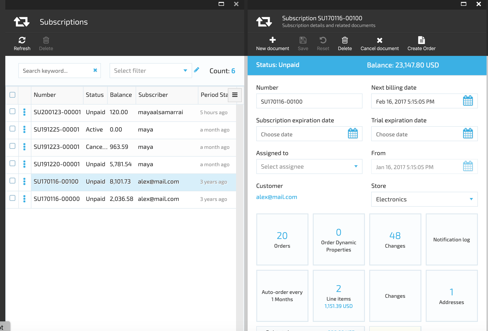
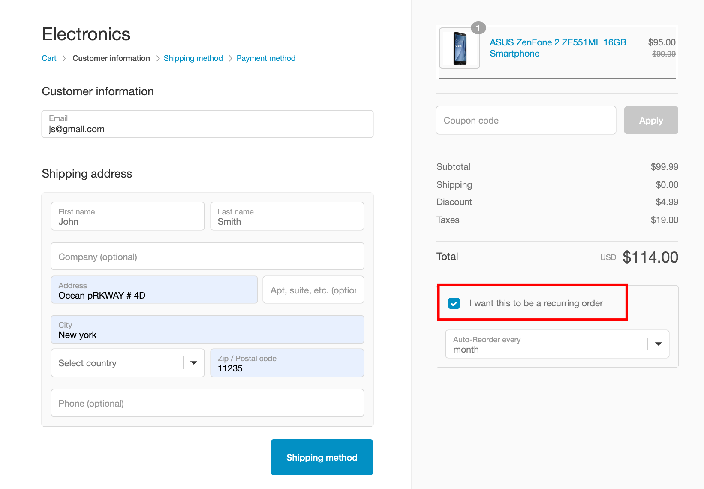
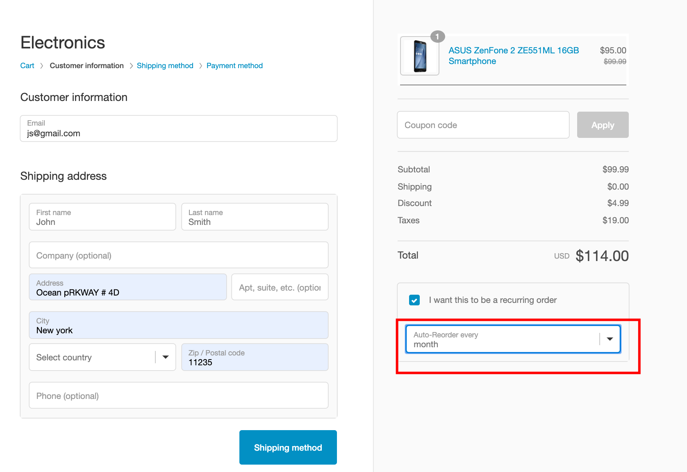
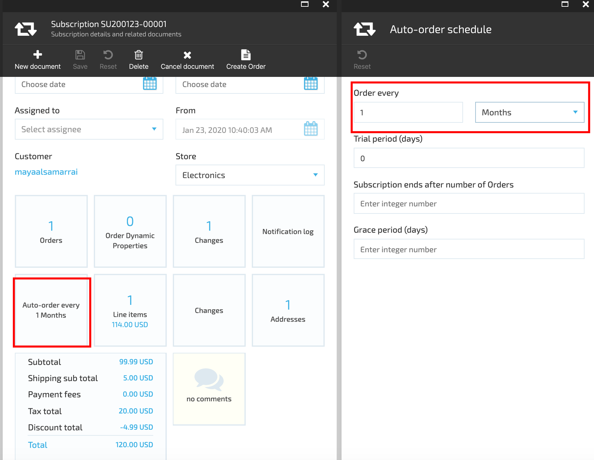
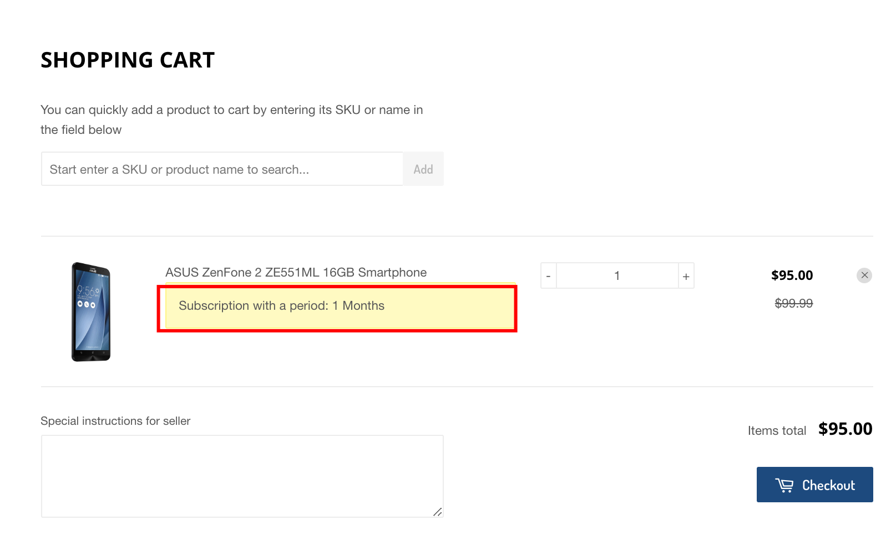

# VirtoCommerce.Subscription

## Overview

VirtoCommerce.Subscription module represents subscriptions and recurring orders management system. It enables retailers to sell subscription-based offerings and shoppers to place recurring orders online.

## Key features

* Trial periods
* Grace periods
* Free subscriptions
* Product or bundle selling on a subscription
* Multiple products via one subscription
* View a list of existing subscriptions with filtration and sorting
* View full subscription history with all notifications, invoices and changes
* Update active subscriptions (including payment plan changes)
* Manual invoicing on subscription with any amount
* Notifications for each life phase and subscription events
* Possibility to use templates for notifications;
* Possibility to edit notification templates and manage the list of notification types
* View information about upcomming Invoice

## Scenarios

### Recurring order scenario

1. Customer adds products to cart and proceeds to checkout;
1. Customer selects "I want this to be a recurring order" option:

1. Customer sets the recurrence parameters:

1. Customer proceeds with the checkout and submits the order;
1. System creates both the order and a subscription based on that order;
1. System background job checks periodically the existing subscriptions and generates new orders (if needed);
1. System sends email notification to the customer about the new order;
1. Customer receives the email and clicks the link to open the order in storefront;
   1. Customer reviews the order and confirms payment;
   1. Alternatively, customer opens the associated subscription and cancels it. No more new orders would be generated for this subscription ever again.

### Subscription scenario

1. Customer Service Representative (CSR) creates a new product and defines auto-order schedule for it on admin side;

1. Customer orders the product on storefront;
1. The system displays the subscription schedule under the product;

1. There will be no possibility to select "I want this to be a recurring order" during checkout;
1. The following steps are identical to the ones in "Recurring order scenario" starting from step 5.

### Subscription states

Subscription "UML state machine" diagram:

### Data flows

Subscriptions are used for generating new Orders under some rules. That is why we always store 2 entities: Subscription and associated Order. The latter we call a "prototype Order" as future Orders will be generated from it.

1. When a Customer creates an Order on storefront, it's sent to Orders service;
1. Orders service saves the Customer Order to database and also fires OrderChangeEvent even;
1. Subscription module receives OrderChangeEvent (containing the Order);
1. If this was a newly created Order with associated payment plan (and not a prototype for some Subscription), then:

     1. Create a new Subscription -
    clone given Order and associate it with the new Subscription.
     If the received Order was generated by a Subscription, then the Subscription should be updated (status, balance recalculated, etc.). This includes the scenario when new Order was generated by Process Subscription Job.

1. Scheduled job initiates Subscription processing periodically. It reads active Subscriptions from database and generates new Orders (if needed).

## Installation

Installing the module:

* Automatically: in VC Manager go to Configuration -> Modules -> Subscription module -> Install

* Manually: download module zip package from https://github.com/VirtoCommerce/vc-module-subscription/releases. In VC Manager go to Configuration -> Modules -> Advanced -> upload module package -> Install.

## Settings

* **Subscription.EnableSubscriptions** - Flag for activating subscriptions in store;
* **Subscription.Status** - Subscription statuses (Trialling, Active, Cancelled, Expired, etc.);
* **Subscription.SubscriptionNewNumberTemplate** - The template (pattern) that will be used to generate the number for new Subscription. Parameters: 0 - date (the UTC time of number generation); 1 - the sequence number;
* **Subscription.EnableSubscriptionProccessJob** - Flag for activating automatic subscription process 
* **Subscription.EnableSubscriptionOrdersCreatejob** - Flag for activating automatic order creation for subscription
* **Subscription.CronExpressionOrdersJob** - Cron expression for scheduling subscription order creation job execution
* **Subscription.PastDue.Delay** - Delay in days when unpaid subscription obtain PastDue status

* **Subscription.CronExpression** - cron expression for scheduling subscription processing job execution.

# Available resources
* API client documentation http://demo.virtocommerce.com/admin/docs/ui/index#!/Subscription_module

## License
Copyright (c) Virto Solutions LTD.  All rights reserved.

Licensed under the Virto Commerce Open Software License (the "License"); you
may not use this file except in compliance with the License. You may
obtain a copy of the License at

http://virtocommerce.com/opensourcelicense

Unless required by applicable law or agreed to in writing, software
distributed under the License is distributed on an "AS IS" BASIS,
WITHOUT WARRANTIES OR CONDITIONS OF ANY KIND, either express or
implied.
